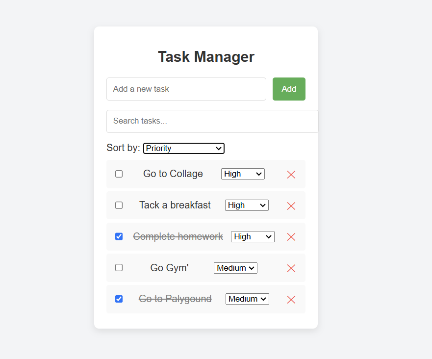

2. Live App- https://6bu4uz68gcmjl7zk.vercel.app/
1.The application and functionality

  This Task Manager app is built using React and Vite. It allows users to manage their tasks with features like adding, deleting, marking tasks as complete, setting priority levels, and sorting tasks by priority or completion status. The app also includes UI animations to improve user experience, and it saves tasks to local storage to persist data across sessions.

  2.The setup and launch process
  Clone the Repository:
  Clone the project from GitHub:  git clone <repository-link>

 Navigate to Project Directory:
 Change into the project’s directory:  cd task-manager-app

 3.Install Dependencies:
 Install the necessary packages:  npm install

 4.Run the Development Server:
 Start the app in development mode: npm run dev

5.Access the Application: Open a browser and navigate to http://localhost:5173.

 3.Assumptions Made During Development
 Unique Task Identifiers: Each task is assigned a unique identifier using the Date.now() function, ensuring that each task has a distinct ID.

 Data Persistence in Local Storage: Task data is saved in the browser's local storage, allowing tasks to persist between sessions on the same device and browser. However, this approach does not sync data across different browsers or devices.

 Sorting Priority Hierarchy: The sorting functionality prioritizes tasks first by priority level (High, Medium, Low) and then by completion status, following a hierarchy for more structured task management.

 Lightweight and Responsive UI Design: The UI design is kept minimalistic and optimized for performance, ensuring fast load times and responsiveness on both mobile and desktop screens.

 Basic Form Validation: Task input fields assume simple validation; empty tasks are prevented, but more complex validation is beyond the app's scope for simplicity.

 

4.Attach screenshots of the project.
### Screenshots

- **Main Screen**: Shows the main interface where users can add and manage tasks.
  

- **Priority**: Demonstrates task sorting and priority settings.
  

- **Task Complation status**: Demonstrates task complation settings.
  

  
- **Task Complation checkout**: Demonstrates task complation settings.
  

  - **Delete task**: Demonstrates  Delete task settings.
  

  - **Serch Task**: Demonstrates Serch Task using serch box.
  

 

 

5.Share the GitHub link for review: https://github.com/vishal14marathe/Task-Manager.git
